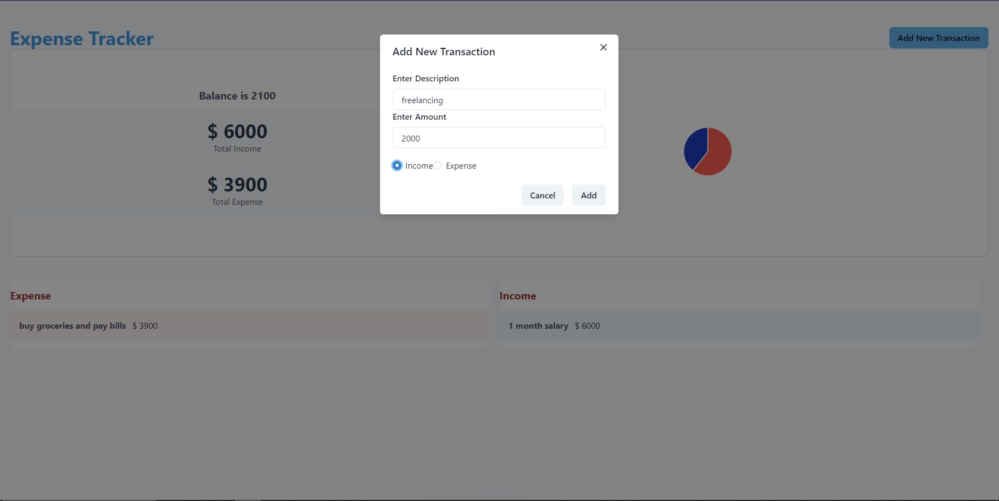
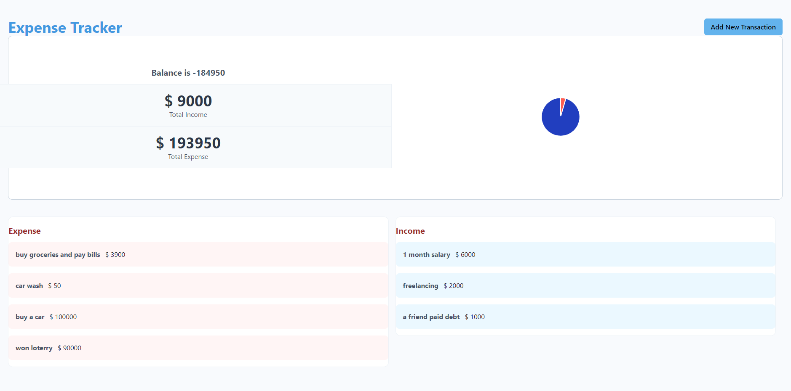

## Expense Tracker App

### Overview

A simple React app for tracking expenses and income. Users can:

- Add descriptions and amounts for each transaction.
- View real-time updates on a dynamic chart.
- See a list of transactions below the chart.

## Tech Stack

- **React**: For building the user interface.
- **Chakra UI**: For styling and components.
- **ApexCharts**: For creating charts.

## Overview

## Credits

This project was made from a [YouTube tutorial](https://www.youtube.com/watch?v=5ZdHfJVAY-s&t=577s) (React 25 Projects - tutorial) by FreeCodeCamp.org.
